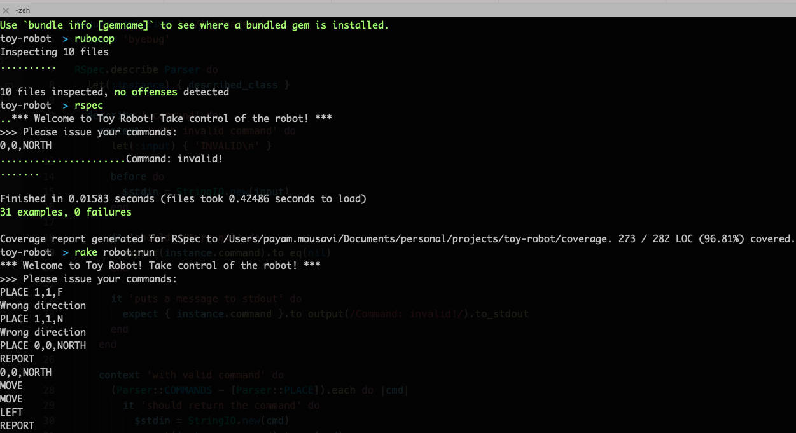
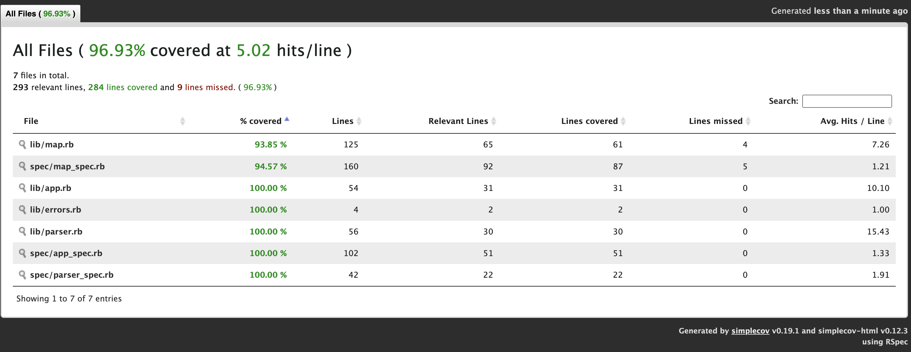
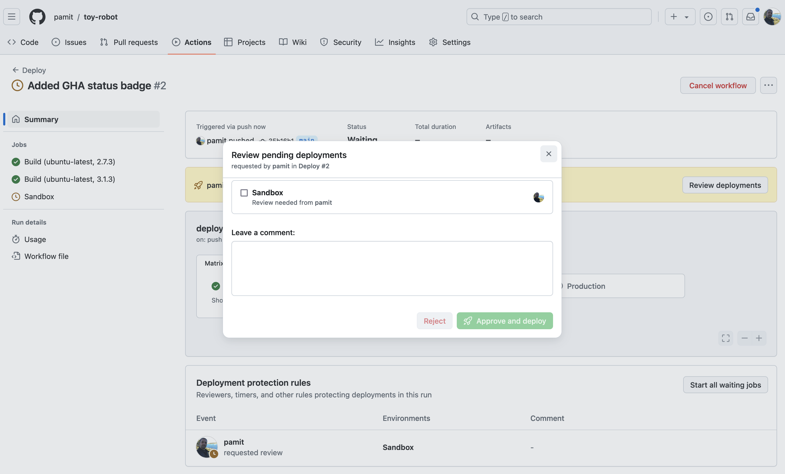

# Toy Robot


## Table of Contents:
- [Toy Robot](#toy-robot)
  - [Table of Contents:](#table-of-contents)
  - [Description](#description)
  - [Constraints](#constraints)
  - [Example Input and Output](#example-input-and-output)
  - [Installation](#installation)
  - [Run](#run)
  - [Development \& Test](#development--test)
  - [Code Coverage](#code-coverage)
  - [CI (GitHub Actions)](#ci-github-actions)

## Description
- The application is a simulation of a toy robot moving on a square tabletop,
  of dimensions 5 units x 5 units.
- There are no other obstructions on the table surface.
- The robot is free to roam around the surface of the table, but must be
  prevented from falling to destruction. Any movement that would result in the
  robot falling from the table must be prevented, however further valid
  movement commands must still be allowed.
- Create an application that can read in commands of the following form:

```
PLACE X,Y,F
MOVE
LEFT
RIGHT
REPORT
```

- PLACE will put the toy robot on the table in position X,Y and facing NORTH,
  SOUTH, EAST or WEST.
- The origin (0,0) can be considered to be the SOUTH WEST most corner.
- The first valid command to the robot is a PLACE command, after that, any
  sequence of commands may be issued, in any order, including another PLACE
  command. The application should discard all commands in the sequence until a
  valid PLACE command has been executed.
- MOVE will move the toy robot one unit forward in the direction it is currently
  facing.
- LEFT and RIGHT will rotate the robot 90 degrees in the specified direction
  without changing the position of the robot.
- REPORT will announce the X,Y and F of the robot. This can be in any form, but
  standard output is sufficient.
- A robot that is not on the table can choose the ignore the MOVE, LEFT, RIGHT
  and REPORT commands.
- Input can be from a file, or from standard input, as the developer chooses.
- Provide test data to exercise the application.

## Constraints
The toy robot must not fall off the table during movement. This also includes
the initial placement of the toy robot. Any move that would cause the robot
to fall must be ignored.

## Example Input and Output

```
PLACE 0,0,NORTH
MOVE
REPORT
Output: 0,1,NORTH
```

```
PLACE 0,0,NORTH
LEFT
REPORT
Output: 0,0,WEST
```

```
PLACE 1,2,EAST
MOVE
MOVE
LEFT
MOVE
REPORT
Output: 3,3,NORTH
```

## Installation
Ruby version: `2.7.3`

```bash
bundle install
```

## Run

```bash
rake robot:run
# or
rake robot:run'[10,10]' # with max width and max height for the map

PLACE X,Y,F
MOVE
LEFT
RIGHT
REPORT
...

quit
```

And with Docker:

```bash
docker build -t toy-robot

docker run -e MAP_MAX_X=10 -e MAP_MAX_Y=10 -it toy-robot
```



## Development & Test
Run Rspec:

```bash
rspec
```

Run Rubocop:
```bash
rubocop
```

## Code Coverage

Using `SimpleCov` to render coverage data:



## CI (GitHub Actions)

This repository uses GitHub Actions to add sample workflow jobs for testing and deploying the app. There are sample environments (`Sandbox` and `Production`) which requires approval from reviewers to deploy to those environments.


